# Bank Manager Client Dashboard — Implementation Plan

## Overview

A SvelteKit web application connected to Firebase (Auth + Firestore) that allows bank managers to:

- **Log in** with email/password
- **View a scrollable list** of their clients with risk & value scores
- **Filter clients** (filter options TBD)
- **Click a client** to open a detail page with scores, explanations, and AI-suggested retention methods (from an external API)
- **Toggle light/dark theme** with a modern minimalistic design

---

## Tech Stack

| Layer         | Technology                                                |
| ------------- | --------------------------------------------------------- |
| Framework     | SvelteKit (latest)                                        |
| Language      | **TypeScript**                                            |
| Styling       | **Tailwind CSS v4**                                       |
| Auth          | Firebase Authentication (email/password)                  |
| Database      | Cloud Firestore                                           |
| Hosting       | Local dev (`npm run dev`) — deployment TBD                |
| Retention API | External (built by another team — will be mocked for now) |

---

## Data Models (Shared Contract)

> [!IMPORTANT]
> All 3 team members MUST use these exact data structures. This is the "contract" that ensures your code connects.

### TypeScript Interfaces — `src/lib/types.ts` (Person 1 creates this)

```typescript
// Manager document from Firestore 'managers' collection
export interface Manager {
	uid: string;
	name: string;
	email: string;
	role: string;
	branch: string;
}

// Client document from Firestore 'clients' collection
export interface Client {
	id: string;
	managerId: string;
	name: string;
	riskScore: number;
	riskExplanation: string;
	valueScore: number;
	valueExplanation: string;
	email: string;
	phone: string;
	accountType: string;
	joinDate: string;
}

// Retention method from external API
export interface RetentionMethod {
	title: string;
	description: string;
	priority: 'high' | 'medium' | 'low';
}

// Filter state
export interface FilterState {
	search: string;
	riskMin: number;
	riskMax: number;
	valueMin: number;
	valueMax: number;
}
```

### Firestore: `managers` collection

```json
{
	"uid": "firebase-auth-uid",
	"name": "John Smith",
	"email": "john@bank.com",
	"role": "Senior Manager",
	"branch": "Downtown"
}
```

### Firestore: `clients` collection

```json
{
	"id": "auto-generated",
	"managerId": "firebase-auth-uid-of-their-manager",
	"name": "Jane Doe",
	"riskScore": 78,
	"riskExplanation": "High likelihood of switching due to...",
	"valueScore": 92,
	"valueExplanation": "Premium account holder with...",
	"email": "jane@example.com",
	"phone": "+1234567890",
	"accountType": "Premium",
	"joinDate": "2020-03-15"
}
```

### Retention API (mocked for now)

```
GET /api/retention?clientId={id}

Response:
{
  "clientId": "abc123",
  "methods": [
    {
      "title": "Offer Premium Rate",
      "description": "Provide a 0.5% higher savings rate...",
      "priority": "high"
    },
    ...
  ]
}
```

---

## Project File Structure & Ownership

```
fintech-hackathon/
├── package.json                          ← Person 1 (setup)
├── svelte.config.js                      ← Person 1 (setup)
├── vite.config.ts                        ← Person 1 (setup)
├── tsconfig.json                         ← Person 1 (setup)
├── firebase.json                         ← Person 1
│
├── src/
│   ├── app.html                          ← Person 1 (setup)
│   ├── app.css                           ← Person 3 (Tailwind + theme tokens)
│   │
│   ├── lib/
│   │   ├── types.ts                      ← Person 1
│   │   │
│   │   ├── firebase/
│   │   │   ├── config.ts                 ← Person 1
│   │   │   ├── auth.ts                   ← Person 1
│   │   │   └── firestore.ts              ← Person 1
│   │   │
│   │   ├── stores/
│   │   │   ├── authStore.ts              ← Person 1
│   │   │   ├── clientStore.ts            ← Person 2
│   │   │   └── themeStore.ts             ← Person 3
│   │   │
│   │   ├── components/
│   │   │   ├── ClientCard.svelte         ← Person 2
│   │   │   ├── ClientList.svelte         ← Person 2
│   │   │   ├── ManagerProfile.svelte     ← Person 2
│   │   │   ├── FilterPanel.svelte        ← Person 2
│   │   │   ├── Sidebar.svelte            ← Person 2
│   │   │   ├── ThemeToggle.svelte        ← Person 3
│   │   │   ├── ScoreBadge.svelte         ← Person 3
│   │   │   ├── RetentionCard.svelte      ← Person 3
│   │   │   └── Navbar.svelte             ← Person 3
│   │   │
│   │   └── api/
│   │       └── retention.ts              ← Person 3
│   │
│   └── routes/
│       ├── +layout.svelte                ← Person 3
│       ├── +layout.ts                    ← Person 1
│       ├── login/
│       │   └── +page.svelte              ← Person 1
│       ├── +page.svelte                  ← Person 2 (dashboard)
│       └── client/
│           └── [id]/
│               └── +page.svelte          ← Person 3
│
└── static/
    └── favicon.png                       ← Person 3
```

> [!WARNING]
> Each person ONLY edits files assigned to them. Since you're on a single branch, editing the same file will cause **merge conflicts**. If you need something from another person's file, **import it** — don't copy it.

---

## Work Execution Order

```mermaid
gantt
    title Work Timeline
    dateFormat  X
    axisFormat %s

    section Person 1
    Init project + push           :p1a, 0, 1
    Firebase config + auth        :p1b, 1, 3
    Firestore service + stores    :p1c, 3, 5
    Login page + route guard      :p1d, 5, 7
    Seed Firestore data           :p1e, 7, 8

    section Person 2
    Wait for project init         :milestone, m1, 1, 0
    Dashboard layout              :p2a, 1, 3
    Client list + card            :p2b, 3, 5
    Manager profile + sidebar     :p2c, 5, 7
    Filter panel                  :p2d, 7, 8

    section Person 3
    Wait for project init         :milestone, m2, 1, 0
    Tailwind theme (app.css)      :p3a, 1, 3
    Layout + navbar + theme       :p3b, 3, 5
    Client detail page            :p3c, 5, 7
    Retention API + cards         :p3d, 7, 8
```



> **Person 1 initializes the project FIRST**, pushes the skeleton, then all 3 work in parallel on their own files.

---

## Person 1 — Firebase, Auth & Project Setup

### Responsibilities

- Initialize the SvelteKit project with TypeScript
- Install Firebase + Tailwind CSS dependencies
- Shared TypeScript interfaces
- Firebase configuration, auth, and Firestore services
- Auth store (reactive user state)
- Login page UI
- Route protection (redirect to `/login` if not authenticated)
- Seed Firestore with sample manager + client data

### Step-by-Step

#### 1. Initialize Project (DO THIS FIRST — before anyone else starts)

```bash
# In the repo root (fintech-hackathon/)
npx -y sv create ./ --template minimal --types ts

npm install
npm install firebase
npm install tailwindcss @tailwindcss/vite

git add .
git commit -m "chore: initialize SvelteKit project with TypeScript, Firebase, Tailwind"
git push
```

#### 2. Configure Tailwind in Vite — `vite.config.ts`

```typescript
import { sveltekit } from '@sveltejs/kit/vite';
import tailwindcss from '@tailwindcss/vite';
import { defineConfig } from 'vite';

export default defineConfig({
	plugins: [tailwindcss(), sveltekit()]
});
```

#### 3. Firebase Console Setup

1. Go to [console.firebase.google.com](https://console.firebase.google.com)
2. Create a new project (e.g., "fintech-hackathon")
3. **Enable Authentication** → Sign-in method → Email/Password → Enable
4. **Create Firestore Database** → Start in test mode (for development)
5. **Create test manager account** in Auth → Users → Add User
6. **Copy your Firebase config** from Project Settings → Your Apps → Web App

#### 4. Files to Create

**`src/lib/types.ts`** — Shared TypeScript interfaces (see Data Models section above)

**`src/lib/firebase/config.ts`** — Firebase initialization

```typescript
import { initializeApp } from 'firebase/app';
import { getAuth } from 'firebase/auth';
import { getFirestore } from 'firebase/firestore';

const firebaseConfig = {
	apiKey: 'YOUR_API_KEY',
	authDomain: 'YOUR_PROJECT.firebaseapp.com',
	projectId: 'YOUR_PROJECT_ID',
	storageBucket: 'YOUR_PROJECT.appspot.com',
	messagingSenderId: 'YOUR_SENDER_ID',
	appId: 'YOUR_APP_ID'
};

const app = initializeApp(firebaseConfig);
export const auth = getAuth(app);
export const db = getFirestore(app);
```

**`src/lib/firebase/auth.ts`** — Auth helper functions

```typescript
import { auth } from './config';
import { signInWithEmailAndPassword, signOut, onAuthStateChanged, type User } from 'firebase/auth';

export async function login(email: string, password: string): Promise<void> {
	await signInWithEmailAndPassword(auth, email, password);
}

export async function logout(): Promise<void> {
	await signOut(auth);
}

export function onAuthChange(callback: (user: User | null) => void): () => void {
	return onAuthStateChanged(auth, callback);
}
```

**`src/lib/firebase/firestore.ts`** — Firestore data access

```typescript
import { db } from './config';
import { collection, query, where, getDocs, doc, getDoc } from 'firebase/firestore';
import type { Manager, Client } from '$lib/types';

export async function getManager(uid: string): Promise<Manager | null> {
	const docRef = doc(db, 'managers', uid);
	const docSnap = await getDoc(docRef);
	if (!docSnap.exists()) return null;
	return { uid: docSnap.id, ...docSnap.data() } as Manager;
}

export async function getClientsByManager(managerId: string): Promise<Client[]> {
	const q = query(collection(db, 'clients'), where('managerId', '==', managerId));
	const snapshot = await getDocs(q);
	return snapshot.docs.map((d) => ({ id: d.id, ...d.data() }) as Client);
}

export async function getClient(clientId: string): Promise<Client | null> {
	const docRef = doc(db, 'clients', clientId);
	const docSnap = await getDoc(docRef);
	if (!docSnap.exists()) return null;
	return { id: docSnap.id, ...docSnap.data() } as Client;
}
```

**`src/lib/stores/authStore.ts`** — Reactive auth state

```typescript
import { writable } from 'svelte/store';
import { onAuthChange } from '$lib/firebase/auth';
import { getManager } from '$lib/firebase/firestore';
import type { User } from 'firebase/auth';
import type { Manager } from '$lib/types';

export const user = writable<User | null>(null);
export const manager = writable<Manager | null>(null);
export const authLoading = writable<boolean>(true);

onAuthChange(async (firebaseUser: User | null) => {
	if (firebaseUser) {
		user.set(firebaseUser);
		const mgr = await getManager(firebaseUser.uid);
		manager.set(mgr);
	} else {
		user.set(null);
		manager.set(null);
	}
	authLoading.set(false);
});
```

**`src/routes/+layout.ts`** — Disable SSR (Firebase is client-side only)

```typescript
export const ssr = false;
```

**`src/routes/login/+page.svelte`** — Login page

```svelte
<script lang="ts">
	import { login } from '$lib/firebase/auth';
	import { user } from '$lib/stores/authStore';
	import { goto } from '$app/navigation';

	let email: string = '';
	let password: string = '';
	let error: string = '';
	let loading: boolean = false;

	$: if ($user) goto('/');

	async function handleLogin(): Promise<void> {
		error = '';
		loading = true;
		try {
			await login(email, password);
			goto('/');
		} catch (err) {
			error = 'Invalid email or password';
		} finally {
			loading = false;
		}
	}
</script>

<div
	class="flex min-h-screen items-center justify-center bg-gray-50 p-4 transition-colors dark:bg-gray-950"
>
	<div
		class="w-full max-w-md rounded-2xl border border-gray-200 bg-white p-10 shadow-lg dark:border-gray-800 dark:bg-gray-900"
	>
		<h1 class="mb-1 text-2xl font-bold text-gray-900 dark:text-gray-100">Welcome Back</h1>
		<p class="mb-6 text-gray-500 dark:text-gray-400">Sign in to your manager dashboard</p>

		{#if error}
			<div
				class="mb-4 rounded-lg bg-red-50 px-4 py-3 text-sm text-red-600 dark:bg-red-950 dark:text-red-400"
			>
				{error}
			</div>
		{/if}

		<form on:submit|preventDefault={handleLogin} class="space-y-5">
			<div>
				<label for="email" class="mb-1 block text-sm font-medium text-gray-600 dark:text-gray-400"
					>Email</label
				>
				<input
					id="email"
					type="email"
					bind:value={email}
					placeholder="manager@bank.com"
					required
					class="w-full rounded-xl border border-gray-200 bg-gray-50 px-4 py-3 text-gray-900 placeholder-gray-400 transition focus:border-indigo-500 focus:ring-2 focus:ring-indigo-500/30 focus:outline-none dark:border-gray-700 dark:bg-gray-800 dark:text-gray-100"
				/>
			</div>

			<div>
				<label
					for="password"
					class="mb-1 block text-sm font-medium text-gray-600 dark:text-gray-400">Password</label
				>
				<input
					id="password"
					type="password"
					bind:value={password}
					placeholder="••••••••"
					required
					class="w-full rounded-xl border border-gray-200 bg-gray-50 px-4 py-3 text-gray-900 placeholder-gray-400 transition focus:border-indigo-500 focus:ring-2 focus:ring-indigo-500/30 focus:outline-none dark:border-gray-700 dark:bg-gray-800 dark:text-gray-100"
				/>
			</div>

			<button
				type="submit"
				disabled={loading}
				class="w-full rounded-xl bg-indigo-600 py-3 font-semibold text-white transition-all hover:-translate-y-0.5 hover:bg-indigo-700 active:translate-y-0 disabled:cursor-not-allowed disabled:opacity-50"
			>
				{loading ? 'Signing in...' : 'Sign In'}
			</button>
		</form>
	</div>
</div>
```

#### 5. Seed Firestore with Sample Data

Go to Firebase Console → Firestore → manually add:

**`managers` collection** — Create a doc with ID = the Auth UID of the test user:

```
Document ID: {copy from Auth → Users → UID}
Fields:
  name: "John Smith"
  email: "john@bank.com"
  role: "Senior Relationship Manager"
  branch: "Downtown"
```

**`clients` collection** — Add 5–10 sample clients:

```
Document ID: auto
Fields:
  managerId: "{same UID as above}"
  name: "Jane Doe"
  riskScore: 78
  riskExplanation: "Client has been exploring competitor offers..."
  valueScore: 92
  valueExplanation: "Premium account holder with high monthly transactions..."
  email: "jane@example.com"
  phone: "+1234567890"
  accountType: "Premium"
  joinDate: "2020-03-15"
```

---

## Person 2 — Dashboard & Client List

### Responsibilities

- Dashboard page layout (main page after login)
- Scrollable client list
- Client card component (shows name, risk score, value score)
- Manager profile panel (top-right)
- Sidebar with filter panel
- Client store (fetching + filtering logic)

### Files to Create

**`src/lib/stores/clientStore.ts`** — Client state management

```typescript
import { writable, derived } from 'svelte/store';
import { getClientsByManager } from '$lib/firebase/firestore';
import type { Client, FilterState } from '$lib/types';

export const clients = writable<Client[]>([]);
export const clientsLoading = writable<boolean>(false);
export const filters = writable<FilterState>({
	search: '',
	riskMin: 0,
	riskMax: 100,
	valueMin: 0,
	valueMax: 100
});

// Derived store: filtered clients
export const filteredClients = derived(
	[clients, filters],
	([$clients, $filters]: [Client[], FilterState]) => {
		return $clients.filter((client: Client) => {
			const matchesSearch = client.name.toLowerCase().includes($filters.search.toLowerCase());
			const matchesRisk =
				client.riskScore >= $filters.riskMin && client.riskScore <= $filters.riskMax;
			const matchesValue =
				client.valueScore >= $filters.valueMin && client.valueScore <= $filters.valueMax;
			return matchesSearch && matchesRisk && matchesValue;
		});
	}
);

export async function loadClients(managerId: string): Promise<void> {
	clientsLoading.set(true);
	try {
		const data = await getClientsByManager(managerId);
		clients.set(data);
	} catch (err) {
		console.error('Failed to load clients:', err);
	} finally {
		clientsLoading.set(false);
	}
}
```

**`src/lib/components/ClientCard.svelte`** — Individual client row

```svelte
<script lang="ts">
	import ScoreBadge from './ScoreBadge.svelte';
	import type { Client } from '$lib/types';

	export let client: Client;
</script>

<a
	href="/client/{client.id}"
	id="client-{client.id}"
	class="flex cursor-pointer items-center justify-between rounded-xl border border-gray-200 bg-white p-4 text-inherit no-underline transition-all hover:-translate-y-0.5 hover:border-indigo-500 hover:shadow-md dark:border-gray-800 dark:bg-gray-900"
>
	<div class="flex items-center gap-3">
		<div
			class="flex h-11 w-11 shrink-0 items-center justify-center rounded-full bg-indigo-50 text-lg font-bold text-indigo-600 dark:bg-indigo-950 dark:text-indigo-400"
		>
			{client.name.charAt(0).toUpperCase()}
		</div>
		<div class="flex flex-col">
			<span class="font-semibold text-gray-900 dark:text-gray-100">{client.name}</span>
			<span class="text-xs text-gray-400 dark:text-gray-500">{client.accountType}</span>
		</div>
	</div>
	<div class="flex gap-3">
		<ScoreBadge label="Risk" score={client.riskScore} type="risk" />
		<ScoreBadge label="Value" score={client.valueScore} type="value" />
	</div>
</a>
```

**`src/lib/components/ClientList.svelte`** — Scrollable client list

```svelte
<script lang="ts">
	import ClientCard from './ClientCard.svelte';
	import { filteredClients, clientsLoading } from '$lib/stores/clientStore';
</script>

<div class="flex min-h-0 flex-1 flex-col" id="client-list">
	<div class="mb-4 flex items-center justify-between">
		<h2 class="text-xl font-semibold text-gray-900 dark:text-gray-100">Clients</h2>
		<span class="rounded-full bg-gray-100 px-3 py-1 text-sm text-gray-400 dark:bg-gray-800">
			{$filteredClients.length} clients
		</span>
	</div>

	{#if $clientsLoading}
		<div class="py-12 text-center text-gray-400">
			<div
				class="mx-auto mb-4 h-8 w-8 animate-spin rounded-full border-3 border-gray-200 border-t-indigo-500 dark:border-gray-700"
			></div>
			<p>Loading clients...</p>
		</div>
	{:else if $filteredClients.length === 0}
		<div class="py-12 text-center text-gray-400">
			<p>No clients match your filters</p>
		</div>
	{:else}
		<div class="scrollbar-thin flex flex-1 flex-col gap-2 overflow-y-auto pr-1">
			{#each $filteredClients as client (client.id)}
				<ClientCard {client} />
			{/each}
		</div>
	{/if}
</div>
```

**`src/lib/components/ManagerProfile.svelte`** — Manager info panel

```svelte
<script lang="ts">
	import { manager } from '$lib/stores/authStore';
	import { logout } from '$lib/firebase/auth';
	import { goto } from '$app/navigation';

	async function handleLogout(): Promise<void> {
		await logout();
		goto('/login');
	}
</script>

<div
	class="rounded-2xl border border-gray-200 bg-white p-5 dark:border-gray-800 dark:bg-gray-900"
	id="manager-profile"
>
	{#if $manager}
		<div class="mb-4 flex items-center gap-3">
			<div
				class="flex h-12 w-12 shrink-0 items-center justify-center rounded-full bg-gradient-to-br from-indigo-500 to-indigo-700 text-xl font-bold text-white"
			>
				{$manager.name?.charAt(0).toUpperCase() ?? '?'}
			</div>
			<div class="flex flex-col">
				<span class="font-bold text-gray-900 dark:text-gray-100">{$manager.name}</span>
				<span class="text-xs text-gray-500 dark:text-gray-400">{$manager.role}</span>
				<span class="text-xs text-gray-400 dark:text-gray-500">{$manager.branch}</span>
			</div>
		</div>
		<button
			on:click={handleLogout}
			class="w-full cursor-pointer rounded-lg border border-gray-200 bg-transparent py-2 text-sm text-gray-500 transition-all hover:border-red-400 hover:bg-red-50 hover:text-red-500 dark:border-gray-700 dark:hover:bg-red-950"
		>
			Sign Out
		</button>
	{:else}
		<p class="text-center text-gray-400">Loading profile...</p>
	{/if}
</div>
```

**`src/lib/components/FilterPanel.svelte`** — Filter controls

```svelte
<script lang="ts">
	import { filters } from '$lib/stores/clientStore';
	import type { FilterState } from '$lib/types';

	function updateFilter<K extends keyof FilterState>(key: K, value: FilterState[K]): void {
		filters.update((f: FilterState) => ({ ...f, [key]: value }));
	}

	function resetFilters(): void {
		filters.set({
			search: '',
			riskMin: 0,
			riskMax: 100,
			valueMin: 0,
			valueMax: 100
		});
	}
</script>

<div
	class="rounded-2xl border border-gray-200 bg-white p-5 dark:border-gray-800 dark:bg-gray-900"
	id="filter-panel"
>
	<div class="mb-4 flex items-center justify-between">
		<h3 class="text-base font-semibold text-gray-900 dark:text-gray-100">Filters</h3>
		<button
			on:click={resetFilters}
			class="cursor-pointer border-none bg-transparent text-xs font-medium text-indigo-500 hover:underline"
		>
			Reset
		</button>
	</div>

	<!-- Search -->
	<div class="mb-4">
		<label
			for="search-filter"
			class="mb-1 block text-xs font-medium text-gray-500 dark:text-gray-400">Search</label
		>
		<input
			id="search-filter"
			type="text"
			placeholder="Client name..."
			value={$filters.search}
			on:input={(e) => updateFilter('search', (e.target as HTMLInputElement).value)}
			class="w-full rounded-lg border border-gray-200 bg-gray-50 px-3 py-2 text-sm text-gray-900 placeholder-gray-400 transition focus:border-indigo-500 focus:outline-none dark:border-gray-700 dark:bg-gray-800 dark:text-gray-100"
		/>
	</div>

	<!-- Risk Score Range -->
	<div class="mb-4">
		<label class="mb-1 block text-xs font-medium text-gray-500 dark:text-gray-400"
			>Risk Score Range</label
		>
		<div class="flex items-center gap-2">
			<input
				id="risk-min"
				type="number"
				min="0"
				max="100"
				value={$filters.riskMin}
				on:input={(e) => updateFilter('riskMin', +(e.target as HTMLInputElement).value)}
				class="flex-1 rounded-lg border border-gray-200 bg-gray-50 px-2 py-2 text-center text-sm text-gray-900 focus:border-indigo-500 focus:outline-none dark:border-gray-700 dark:bg-gray-800 dark:text-gray-100"
			/>
			<span class="text-gray-400">—</span>
			<input
				id="risk-max"
				type="number"
				min="0"
				max="100"
				value={$filters.riskMax}
				on:input={(e) => updateFilter('riskMax', +(e.target as HTMLInputElement).value)}
				class="flex-1 rounded-lg border border-gray-200 bg-gray-50 px-2 py-2 text-center text-sm text-gray-900 focus:border-indigo-500 focus:outline-none dark:border-gray-700 dark:bg-gray-800 dark:text-gray-100"
			/>
		</div>
	</div>

	<!-- Value Score Range -->
	<div class="mb-4">
		<label class="mb-1 block text-xs font-medium text-gray-500 dark:text-gray-400"
			>Value Score Range</label
		>
		<div class="flex items-center gap-2">
			<input
				id="value-min"
				type="number"
				min="0"
				max="100"
				value={$filters.valueMin}
				on:input={(e) => updateFilter('valueMin', +(e.target as HTMLInputElement).value)}
				class="flex-1 rounded-lg border border-gray-200 bg-gray-50 px-2 py-2 text-center text-sm text-gray-900 focus:border-indigo-500 focus:outline-none dark:border-gray-700 dark:bg-gray-800 dark:text-gray-100"
			/>
			<span class="text-gray-400">—</span>
			<input
				id="value-max"
				type="number"
				min="0"
				max="100"
				value={$filters.valueMax}
				on:input={(e) => updateFilter('valueMax', +(e.target as HTMLInputElement).value)}
				class="flex-1 rounded-lg border border-gray-200 bg-gray-50 px-2 py-2 text-center text-sm text-gray-900 focus:border-indigo-500 focus:outline-none dark:border-gray-700 dark:bg-gray-800 dark:text-gray-100"
			/>
		</div>
	</div>

	<!-- MORE FILTERS WILL BE ADDED HERE LATER -->
</div>
```

**`src/lib/components/Sidebar.svelte`** — Right sidebar layout

```svelte
<script lang="ts">
	import ManagerProfile from './ManagerProfile.svelte';
	import FilterPanel from './FilterPanel.svelte';
</script>

<aside class="flex h-full w-80 shrink-0 flex-col gap-4 overflow-y-auto max-md:w-full" id="sidebar">
	<ManagerProfile />
	<FilterPanel />
</aside>
```

**`src/routes/+page.svelte`** — Dashboard (main page)

```svelte
<script lang="ts">
	import { user, authLoading } from '$lib/stores/authStore';
	import { loadClients } from '$lib/stores/clientStore';
	import { goto } from '$app/navigation';
	import ClientList from '$lib/components/ClientList.svelte';
	import Sidebar from '$lib/components/Sidebar.svelte';

	$: if (!$authLoading && !$user) goto('/login');
	$: if ($user) loadClients($user.uid);
</script>

{#if $authLoading}
	<div class="flex h-screen items-center justify-center">
		<div
			class="h-10 w-10 animate-spin rounded-full border-3 border-gray-200 border-t-indigo-500 dark:border-gray-700"
		></div>
	</div>
{:else if $user}
	<div
		class="mx-auto flex h-[calc(100vh-64px)] max-w-7xl gap-6 p-6 max-md:h-auto max-md:flex-col-reverse"
		id="dashboard"
	>
		<main class="flex min-w-0 flex-1 flex-col">
			<ClientList />
		</main>
		<Sidebar />
	</div>
{/if}
```

---

## Person 3 — Design System, Layout, Client Detail & Theme

### Responsibilities

- Tailwind CSS setup with custom theme tokens (`app.css`)
- Root layout with navbar
- Theme toggle component (light/dark)
- Score badge component (reused by Person 2)
- Client detail page
- Retention API integration (mocked)
- Retention card component

### Files to Create

**`src/app.css`** — Tailwind import + custom utilities

```css
@import 'tailwindcss';

/*
  Tailwind v4 uses CSS-first configuration.
  Dark mode is handled via the 'dark' class on <html>.
  Custom utilities and overrides go here.
*/

/* Smooth scrollbar styling */
.scrollbar-thin::-webkit-scrollbar {
	width: 6px;
}
.scrollbar-thin::-webkit-scrollbar-track {
	background: transparent;
}
.scrollbar-thin::-webkit-scrollbar-thumb {
	background: var(--color-gray-300);
	border-radius: 3px;
}
.dark .scrollbar-thin::-webkit-scrollbar-thumb {
	background: var(--color-gray-700);
}

/* Custom border-width utility for loading spinners */
.border-3 {
	border-width: 3px;
}
```

**`src/lib/stores/themeStore.ts`** — Theme toggle state

```typescript
import { writable } from 'svelte/store';
import { browser } from '$app/environment';

const stored: string | null = browser ? localStorage.getItem('theme') : null;
export const theme = writable<'light' | 'dark'>((stored as 'light' | 'dark') || 'light');

theme.subscribe((value: string) => {
	if (browser) {
		if (value === 'dark') {
			document.documentElement.classList.add('dark');
		} else {
			document.documentElement.classList.remove('dark');
		}
		localStorage.setItem('theme', value);
	}
});

export function toggleTheme(): void {
	theme.update((t: string) => (t === 'light' ? 'dark' : 'light'));
}
```

**`src/lib/components/ThemeToggle.svelte`** — Light/dark switch

```svelte
<script lang="ts">
	import { theme, toggleTheme } from '$lib/stores/themeStore';
</script>

<button
	id="theme-toggle"
	on:click={toggleTheme}
	aria-label="Toggle theme"
	title={$theme === 'light' ? 'Switch to dark mode' : 'Switch to light mode'}
	class="flex h-10 w-10 cursor-pointer items-center justify-center rounded-xl border border-gray-200 bg-gray-100 text-gray-500 transition-all hover:border-indigo-500 hover:text-indigo-500 dark:border-gray-700 dark:bg-gray-800 dark:text-gray-400"
>
	{#if $theme === 'light'}
		<svg
			width="20"
			height="20"
			viewBox="0 0 24 24"
			fill="none"
			stroke="currentColor"
			stroke-width="2"
		>
			<path d="M21 12.79A9 9 0 1 1 11.21 3 7 7 0 0 0 21 12.79z" />
		</svg>
	{:else}
		<svg
			width="20"
			height="20"
			viewBox="0 0 24 24"
			fill="none"
			stroke="currentColor"
			stroke-width="2"
		>
			<circle cx="12" cy="12" r="5" />
			<line x1="12" y1="1" x2="12" y2="3" />
			<line x1="12" y1="21" x2="12" y2="23" />
			<line x1="4.22" y1="4.22" x2="5.64" y2="5.64" />
			<line x1="18.36" y1="18.36" x2="19.78" y2="19.78" />
			<line x1="1" y1="12" x2="3" y2="12" />
			<line x1="21" y1="12" x2="23" y2="12" />
			<line x1="4.22" y1="19.78" x2="5.64" y2="18.36" />
			<line x1="18.36" y1="5.64" x2="19.78" y2="4.22" />
		</svg>
	{/if}
</button>
```

**`src/lib/components/ScoreBadge.svelte`** — Reusable score indicator

```svelte
<script lang="ts">
	export let label: string = '';
	export let score: number = 0;
	export let type: 'risk' | 'value' = 'risk';

	// Risk: high = red (bad), low = green (good)
	// Value: high = green (good), low = red (bad)
	$: colorClass =
		type === 'risk'
			? score >= 70
				? 'text-red-600 bg-red-50 dark:text-red-400 dark:bg-red-950'
				: score >= 40
					? 'text-amber-600 bg-amber-50 dark:text-amber-400 dark:bg-amber-950'
					: 'text-emerald-600 bg-emerald-50 dark:text-emerald-400 dark:bg-emerald-950'
			: score >= 70
				? 'text-emerald-600 bg-emerald-50 dark:text-emerald-400 dark:bg-emerald-950'
				: score >= 40
					? 'text-amber-600 bg-amber-50 dark:text-amber-400 dark:bg-amber-950'
					: 'text-red-600 bg-red-50 dark:text-red-400 dark:bg-red-950';
</script>

<div class="flex min-w-14 flex-col items-center rounded-xl px-3 py-1.5 {colorClass}">
	<span class="text-[0.65rem] font-medium tracking-wide uppercase opacity-85">{label}</span>
	<span class="text-lg font-bold">{score}</span>
</div>
```

**`src/lib/components/Navbar.svelte`** — Top navigation bar

```svelte
<script lang="ts">
	import ThemeToggle from './ThemeToggle.svelte';
</script>

<nav
	class="sticky top-0 z-50 h-16 border-b border-gray-200 bg-white/80 backdrop-blur-xl dark:border-gray-800 dark:bg-gray-900/80"
	id="navbar"
>
	<div class="mx-auto flex h-full max-w-7xl items-center justify-between px-6">
		<a href="/" class="flex items-center gap-2 no-underline">
			<span class="text-2xl">🏦</span>
			<span class="text-xl font-bold text-gray-900 dark:text-gray-100">ClientGuard</span>
		</a>
		<ThemeToggle />
	</div>
</nav>
```

**`src/routes/+layout.svelte`** — Root layout (wraps all pages)

```svelte
<script lang="ts">
	import '../app.css';
	import Navbar from '$lib/components/Navbar.svelte';
	import { page } from '$app/stores';

	// Don't show navbar on login page
	$: isLoginPage = $page.url.pathname === '/login';
</script>

<div
	class="min-h-screen bg-gray-50 text-gray-900 transition-colors dark:bg-gray-950 dark:text-gray-100"
>
	{#if isLoginPage}
		<slot />
	{:else}
		<Navbar />
		<slot />
	{/if}
</div>
```

**`src/lib/api/retention.ts`** — Retention API client (mocked for now)

```typescript
import type { RetentionMethod } from '$lib/types';

/**
 * Fetch suggested retention methods for a client.
 * Replace the mock with the real API URL once the API team provides it.
 */
const API_BASE_URL: string = 'https://your-api-url.com'; // TODO: replace with real URL

export async function getRetentionMethods(clientId: string): Promise<RetentionMethod[]> {
	try {
		const res = await fetch(`${API_BASE_URL}/api/retention?clientId=${clientId}`);
		if (!res.ok) throw new Error('API error');
		const data = await res.json();
		return data.methods || [];
	} catch (err) {
		console.warn('Retention API unavailable, using mock data:', err);
		// Mock fallback while API is not ready
		return [
			{
				title: 'Personalized Rate Offer',
				description:
					'Offer a tailored interest rate increase of 0.25% on their primary savings account to demonstrate value.',
				priority: 'high'
			},
			{
				title: 'Dedicated Support Line',
				description:
					'Assign a dedicated relationship manager with priority phone support to improve service experience.',
				priority: 'medium'
			},
			{
				title: 'Fee Waiver Package',
				description:
					'Waive monthly maintenance fees for the next 12 months as a loyalty incentive.',
				priority: 'medium'
			},
			{
				title: 'Financial Planning Session',
				description: 'Offer a complimentary financial planning session to deepen the relationship.',
				priority: 'low'
			}
		];
	}
}
```

**`src/lib/components/RetentionCard.svelte`** — Retention method card

```svelte
<script lang="ts">
	import type { RetentionMethod } from '$lib/types';

	export let method: RetentionMethod;

	const priorityClasses: Record<string, string> = {
		high: 'text-red-600 bg-red-50 dark:text-red-400 dark:bg-red-950',
		medium: 'text-amber-600 bg-amber-50 dark:text-amber-400 dark:bg-amber-950',
		low: 'text-emerald-600 bg-emerald-50 dark:text-emerald-400 dark:bg-emerald-950'
	};

	$: pClass = priorityClasses[method.priority] || priorityClasses.medium;
</script>

<div
	class="rounded-xl border border-gray-200 bg-white p-5 transition hover:border-indigo-500 dark:border-gray-800 dark:bg-gray-900"
>
	<div class="mb-2 flex items-center justify-between gap-2">
		<h4 class="m-0 text-base font-semibold text-gray-900 dark:text-gray-100">{method.title}</h4>
		<span
			class="rounded-md px-2.5 py-0.5 text-[0.7rem] font-semibold tracking-wide whitespace-nowrap uppercase {pClass}"
		>
			{method.priority}
		</span>
	</div>
	<p class="text-sm leading-relaxed text-gray-500 dark:text-gray-400">{method.description}</p>
</div>
```

**`src/routes/client/[id]/+page.svelte`** — Client detail page

```svelte
<script lang="ts">
	import { onMount } from 'svelte';
	import { page } from '$app/stores';
	import { user, authLoading } from '$lib/stores/authStore';
	import { goto } from '$app/navigation';
	import { getClient } from '$lib/firebase/firestore';
	import { getRetentionMethods } from '$lib/api/retention';
	import ScoreBadge from '$lib/components/ScoreBadge.svelte';
	import RetentionCard from '$lib/components/RetentionCard.svelte';
	import type { Client, RetentionMethod } from '$lib/types';

	let client: Client | null = null;
	let retentionMethods: RetentionMethod[] = [];
	let loading: boolean = true;

	$: if (!$authLoading && !$user) goto('/login');

	onMount(async () => {
		const clientId: string = $page.params.id;
		client = await getClient(clientId);
		retentionMethods = await getRetentionMethods(clientId);
		loading = false;
	});
</script>

{#if loading}
	<div class="flex h-[60vh] flex-col items-center justify-center text-gray-400">
		<div
			class="mb-4 h-9 w-9 animate-spin rounded-full border-3 border-gray-200 border-t-indigo-500 dark:border-gray-700"
		></div>
		<p>Loading client details...</p>
	</div>
{:else if client}
	<div class="mx-auto max-w-4xl px-6 py-8" id="client-detail">
		<!-- Header -->
		<div class="mb-8">
			<a
				href="/"
				class="mb-3 inline-block text-sm font-medium text-indigo-500 transition hover:opacity-70"
				>← Back to Dashboard</a
			>
			<h1 class="m-0 text-3xl font-bold text-gray-900 dark:text-gray-100">{client.name}</h1>
			<span class="text-sm text-gray-400">{client.accountType} Account</span>
		</div>

		<!-- Score Cards Grid -->
		<div class="mb-8 grid grid-cols-1 gap-5 md:grid-cols-2">
			<!-- Risk Score -->
			<div
				class="rounded-2xl border border-gray-200 bg-white p-6 dark:border-gray-800 dark:bg-gray-900"
			>
				<div class="mb-4 flex items-center justify-between">
					<h2 class="m-0 text-lg font-semibold text-gray-900 dark:text-gray-100">Risk Score</h2>
					<ScoreBadge label="Risk" score={client.riskScore} type="risk" />
				</div>
				<p class="text-sm leading-relaxed text-gray-500 dark:text-gray-400">
					{client.riskExplanation}
				</p>
			</div>

			<!-- Value Score -->
			<div
				class="rounded-2xl border border-gray-200 bg-white p-6 dark:border-gray-800 dark:bg-gray-900"
			>
				<div class="mb-4 flex items-center justify-between">
					<h2 class="m-0 text-lg font-semibold text-gray-900 dark:text-gray-100">Value Score</h2>
					<ScoreBadge label="Value" score={client.valueScore} type="value" />
				</div>
				<p class="text-sm leading-relaxed text-gray-500 dark:text-gray-400">
					{client.valueExplanation}
				</p>
			</div>
		</div>

		<!-- Retention Methods -->
		<section id="retention-methods">
			<h2 class="mb-4 text-xl font-semibold text-gray-900 dark:text-gray-100">
				Suggested Retention Methods
			</h2>
			<div class="grid grid-cols-1 gap-4 md:grid-cols-2">
				{#each retentionMethods as method}
					<RetentionCard {method} />
				{/each}
			</div>
		</section>
	</div>
{:else}
	<div class="py-16 text-center text-gray-400">
		<h2 class="mb-2 text-xl">Client not found</h2>
		<a href="/" class="text-indigo-500 hover:underline">Return to dashboard</a>
	</div>
{/if}
```

---

## Work Order Summary

| Order | Who          | Task                                                      | Depends On           |
| ----- | ------------ | --------------------------------------------------------- | -------------------- |
| 1     | Person 1     | Initialize SvelteKit + install Firebase + Tailwind + push | Nothing (START HERE) |
| 2     | Person 2 + 3 | Pull, start working on own files                          | Step 1 done          |
| 3     | Person 1     | Firebase config, auth, Firestore, types, login page       | Step 1               |
| 4     | Person 2     | Client store, components, dashboard page                  | Step 1               |
| 5     | Person 3     | app.css, layout, theme, detail page, API                  | Step 1               |
| 6     | All          | Pull all changes, test integration                        | Steps 3-5            |

> [!IMPORTANT]
> **Merge conflict prevention**: Each person creates ONLY the files in their column above. The only files Person 1 creates that others import from are `src/lib/firebase/`, `src/lib/stores/authStore.ts`, and `src/lib/types.ts` — these are **read-only** for Person 2 and 3 (they import but never edit them).

---

## Verification Plan

### Automated Tests

```bash
npm run dev    # Start the dev server
```

### Manual Verification Checklist

1. ✅ App loads at `http://localhost:5173`
2. ✅ Redirects to `/login` when not authenticated
3. ✅ Login works with email/password → redirects to dashboard
4. ✅ Dashboard shows manager profile (top-right sidebar)
5. ✅ Client list is scrollable and populated from Firestore
6. ✅ Risk & value scores shown with color-coded badges
7. ✅ Filters narrow down the client list
8. ✅ Clicking a client navigates to `/client/[id]`
9. ✅ Client detail page shows scores + explanations
10. ✅ Retention methods displayed (mocked for now)
11. ✅ Theme toggle switches light ↔ dark (persists in localStorage)
12. ✅ Logout returns to login page
13. ✅ Tailwind dark mode classes render correctly

---

## Open Questions

> [!IMPORTANT]
> **Retention API URL** — Once the API team provides the endpoint URL, Person 3 needs to update `src/lib/api/retention.ts` with the real URL (replace the `API_BASE_URL` constant).

> [!NOTE]
> **Filter options** — The filter panel currently supports search by name and score ranges. When you provide the additional filter options, they'll be added to `FilterPanel.svelte` and the `clientStore.ts` filter logic.

> [!NOTE]
> **Firebase config values** — Person 1 will need the actual Firebase project credentials after creating the project in the Firebase Console. These go in `src/lib/firebase/config.ts`.
