# Bank Manager Client Dashboard — Implementation Plan

## Overview

A SvelteKit web application connected to Firebase (Auth + Firestore) that allows bank managers to:

- **Log in** with email/password
- **View a scrollable list** of their clients with risk & value scores
- **Filter clients** (filter options TBD)
- **Click a client** to open a detail page with scores, explanations, and AI-suggested retention methods (from an external API)
- **Toggle light/dark theme** with a modern minimalistic design

---

## Tech Stack

| Layer         | Technology                                                |
| ------------- | --------------------------------------------------------- |
| Framework     | SvelteKit (latest)                                        |
| Language      | JavaScript                                                |
| Styling       | Vanilla CSS with CSS custom properties (design tokens)    |
| Auth          | Firebase Authentication (email/password)                  |
| Database      | Cloud Firestore                                           |
| Hosting       | Local dev (`npm run dev`) — deployment TBD                |
| Retention API | External (built by another team — will be mocked for now) |

---

## Data Models (Shared Contract)

> [!IMPORTANT]
> All 3 team members MUST use these exact data structures. This is the "contract" that ensures your code connects.

### Firestore: `managers` collection

```json
{
  "uid": "firebase-auth-uid",
  "name": "John Smith",
  "email": "john@bank.com",
  "role": "Senior Manager",
  "branch": "Downtown"
}
```

### Firestore: `clients` collection

```json
{
  "id": "auto-generated",
  "managerId": "firebase-auth-uid-of-their-manager",
  "name": "Jane Doe",
  "riskScore": 78,
  "riskExplanation": "High likelihood of switching due to...",
  "valueScore": 92,
  "valueExplanation": "Premium account holder with...",
  "email": "jane@example.com",
  "phone": "+1234567890",
  "accountType": "Premium",
  "joinDate": "2020-03-15"
}
```

### Retention API (mocked for now)

```
GET /api/retention?clientId={id}

Response:
{
  "clientId": "abc123",
  "methods": [
    {
      "title": "Offer Premium Rate",
      "description": "Provide a 0.5% higher savings rate...",
      "priority": "high"
    },
    ...
  ]
}
```

---

## Project File Structure & Ownership

```
fintech-hackathon/
├── package.json                          ← Person 1 (setup)
├── svelte.config.js                      ← Person 1 (setup)
├── vite.config.js                        ← Person 1 (setup)
├── firebase.json                         ← Person 1
│
├── src/
│   ├── app.html                          ← Person 1 (setup)
│   ├── app.css                           ← Person 3
│   │
│   ├── lib/
│   │   ├── firebase/
│   │   │   ├── config.js                 ← Person 1
│   │   │   ├── auth.js                   ← Person 1
│   │   │   └── firestore.js              ← Person 1
│   │   │
│   │   ├── stores/
│   │   │   ├── authStore.js              ← Person 1
│   │   │   ├── clientStore.js            ← Person 2
│   │   │   └── themeStore.js             ← Person 3
│   │   │
│   │   ├── components/
│   │   │   ├── ClientCard.svelte         ← Person 2
│   │   │   ├── ClientList.svelte         ← Person 2
│   │   │   ├── ManagerProfile.svelte     ← Person 2
│   │   │   ├── FilterPanel.svelte        ← Person 2
│   │   │   ├── Sidebar.svelte            ← Person 2
│   │   │   ├── ThemeToggle.svelte        ← Person 3
│   │   │   ├── ScoreBadge.svelte         ← Person 3
│   │   │   ├── RetentionCard.svelte      ← Person 3
│   │   │   └── Navbar.svelte             ← Person 3
│   │   │
│   │   └── api/
│   │       └── retention.js              ← Person 3
│   │
│   └── routes/
│       ├── +layout.svelte                ← Person 3
│       ├── +layout.js                    ← Person 1
│       ├── login/
│       │   └── +page.svelte              ← Person 1
│       ├── +page.svelte                  ← Person 2 (dashboard)
│       └── client/
│           └── [id]/
│               └── +page.svelte          ← Person 3
│
└── static/
    └── favicon.png                       ← Person 3
```

> [!WARNING]
> Each person ONLY edits files assigned to them. Since you're on a single branch, editing the same file will cause **merge conflicts**. If you need something from another person's file, **import it** — don't copy it.

---

## Work Execution Order

```mermaid
gantt
    title Work Timeline
    dateFormat  X
    axisFormat %s

    section Person 1
    Init project + push           :p1a, 0, 1
    Firebase config + auth        :p1b, 1, 3
    Firestore service + stores    :p1c, 3, 5
    Login page + route guard      :p1d, 5, 7
    Seed Firestore data           :p1e, 7, 8

    section Person 2
    Wait for project init         :milestone, m1, 1, 0
    Dashboard layout              :p2a, 1, 3
    Client list + card            :p2b, 3, 5
    Manager profile + sidebar     :p2c, 5, 7
    Filter panel                  :p2d, 7, 8

    section Person 3
    Wait for project init         :milestone, m2, 1, 0
    Design system (app.css)       :p3a, 1, 3
    Layout + navbar + theme       :p3b, 3, 5
    Client detail page            :p3c, 5, 7
    Retention API + cards         :p3d, 7, 8
```



> **Person 1 initializes the project FIRST**, pushes the skeleton, then all 3 work in parallel on their own files.

---

## Person 1 — Firebase & Authentication

### Responsibilities

- Initialize the SvelteKit project
- Set up Firebase project in Firebase Console
- Firebase configuration, auth, and Firestore services
- Auth store (reactive user state)
- Login page UI
- Route protection (redirect to `/login` if not authenticated)
- Seed Firestore with sample manager + client data

### Step-by-Step

#### 1. Initialize Project (DO THIS FIRST — before anyone else starts)

```bash
# In the repo root (fintech-hackathon/)
npx -y sv create ./
# Choose: SvelteKit minimal, JavaScript, no extras

npm install
npm install firebase
git add .
git commit -m "chore: initialize SvelteKit project with Firebase"
git push
```

#### 2. Firebase Console Setup

1. Go to [console.firebase.google.com](https://console.firebase.google.com)
2. Create a new project (e.g., "fintech-hackathon")
3. **Enable Authentication** → Sign-in method → Email/Password → Enable
4. **Create Firestore Database** → Start in test mode (for development)
5. **Create test manager account** in Auth → Users → Add User
6. **Copy your Firebase config** from Project Settings → Your Apps → Web App

#### 3. Files to Create

**`src/lib/firebase/config.js`** — Firebase initialization

```javascript
import { initializeApp } from "firebase/app";
import { getAuth } from "firebase/auth";
import { getFirestore } from "firebase/firestore";

const firebaseConfig = {
  apiKey: "YOUR_API_KEY",
  authDomain: "YOUR_PROJECT.firebaseapp.com",
  projectId: "YOUR_PROJECT_ID",
  storageBucket: "YOUR_PROJECT.appspot.com",
  messagingSenderId: "YOUR_SENDER_ID",
  appId: "YOUR_APP_ID",
};

const app = initializeApp(firebaseConfig);
export const auth = getAuth(app);
export const db = getFirestore(app);
```

**`src/lib/firebase/auth.js`** — Auth helper functions

```javascript
import { auth } from "./config.js";
import {
  signInWithEmailAndPassword,
  signOut,
  onAuthStateChanged,
} from "firebase/auth";

export async function login(email, password) {
  return signInWithEmailAndPassword(auth, email, password);
}

export async function logout() {
  return signOut(auth);
}

export function onAuthChange(callback) {
  return onAuthStateChanged(auth, callback);
}
```

**`src/lib/firebase/firestore.js`** — Firestore data access

```javascript
import { db } from "./config.js";
import {
  collection,
  query,
  where,
  getDocs,
  doc,
  getDoc,
} from "firebase/firestore";

export async function getManager(uid) {
  const docRef = doc(db, "managers", uid);
  const docSnap = await getDoc(docRef);
  return docSnap.exists() ? { id: docSnap.id, ...docSnap.data() } : null;
}

export async function getClientsByManager(managerId) {
  const q = query(
    collection(db, "clients"),
    where("managerId", "==", managerId),
  );
  const snapshot = await getDocs(q);
  return snapshot.docs.map((d) => ({ id: d.id, ...d.data() }));
}

export async function getClient(clientId) {
  const docRef = doc(db, "clients", clientId);
  const docSnap = await getDoc(docRef);
  return docSnap.exists() ? { id: docSnap.id, ...docSnap.data() } : null;
}
```

**`src/lib/stores/authStore.js`** — Reactive auth state

```javascript
import { writable } from "svelte/store";
import { onAuthChange } from "$lib/firebase/auth.js";
import { getManager } from "$lib/firebase/firestore.js";

export const user = writable(null); // Firebase auth user
export const manager = writable(null); // Manager profile from Firestore
export const authLoading = writable(true); // Loading state

onAuthChange(async (firebaseUser) => {
  if (firebaseUser) {
    user.set(firebaseUser);
    const mgr = await getManager(firebaseUser.uid);
    manager.set(mgr);
  } else {
    user.set(null);
    manager.set(null);
  }
  authLoading.set(false);
});
```

**`src/routes/+layout.js`** — Disable SSR (Firebase is client-side only)

```javascript
export const ssr = false;
```

**`src/routes/login/+page.svelte`** — Login page

```svelte
<script>
  import { login } from '$lib/firebase/auth.js';
  import { user } from '$lib/stores/authStore.js';
  import { goto } from '$app/navigation';

  let email = '';
  let password = '';
  let error = '';
  let loading = false;

  // Redirect if already logged in
  $: if ($user) goto('/');

  async function handleLogin() {
    error = '';
    loading = true;
    try {
      await login(email, password);
      goto('/');
    } catch (err) {
      error = 'Invalid email or password';
    } finally {
      loading = false;
    }
  }
</script>

<div class="login-container">
  <div class="login-card">
    <h1>Welcome Back</h1>
    <p class="subtitle">Sign in to your manager dashboard</p>

    {#if error}
      <div class="error-message">{error}</div>
    {/if}

    <form on:submit|preventDefault={handleLogin}>
      <div class="form-group">
        <label for="email">Email</label>
        <input
          id="email"
          type="email"
          bind:value={email}
          placeholder="manager@bank.com"
          required
        />
      </div>

      <div class="form-group">
        <label for="password">Password</label>
        <input
          id="password"
          type="password"
          bind:value={password}
          placeholder="••••••••"
          required
        />
      </div>

      <button type="submit" class="btn-primary" disabled={loading}>
        {loading ? 'Signing in...' : 'Sign In'}
      </button>
    </form>
  </div>
</div>

<style>
  .login-container {
    min-height: 100vh;
    display: flex;
    align-items: center;
    justify-content: center;
    background: var(--bg-primary);
    padding: 1rem;
  }

  .login-card {
    background: var(--bg-card);
    border: 1px solid var(--border);
    border-radius: 16px;
    padding: 2.5rem;
    width: 100%;
    max-width: 420px;
    box-shadow: var(--shadow-lg);
  }

  h1 {
    margin: 0 0 0.25rem;
    font-size: 1.75rem;
    color: var(--text-primary);
  }

  .subtitle {
    color: var(--text-secondary);
    margin: 0 0 1.5rem;
  }

  .form-group {
    margin-bottom: 1.25rem;
  }

  label {
    display: block;
    font-size: 0.875rem;
    font-weight: 500;
    color: var(--text-secondary);
    margin-bottom: 0.375rem;
  }

  input {
    width: 100%;
    padding: 0.75rem 1rem;
    border: 1px solid var(--border);
    border-radius: 10px;
    background: var(--bg-input);
    color: var(--text-primary);
    font-size: 1rem;
    transition: border-color 0.2s;
    box-sizing: border-box;
  }

  input:focus {
    outline: none;
    border-color: var(--accent);
    box-shadow: 0 0 0 3px var(--accent-glow);
  }

  .btn-primary {
    width: 100%;
    padding: 0.75rem;
    border: none;
    border-radius: 10px;
    background: var(--accent);
    color: #fff;
    font-size: 1rem;
    font-weight: 600;
    cursor: pointer;
    transition: opacity 0.2s, transform 0.1s;
  }

  .btn-primary:hover:not(:disabled) {
    opacity: 0.9;
    transform: translateY(-1px);
  }

  .btn-primary:disabled {
    opacity: 0.5;
    cursor: not-allowed;
  }

  .error-message {
    background: var(--danger-bg);
    color: var(--danger);
    padding: 0.75rem 1rem;
    border-radius: 8px;
    margin-bottom: 1rem;
    font-size: 0.875rem;
  }
</style>
```

#### 4. Seed Firestore with Sample Data

Go to Firebase Console → Firestore → manually add, or use a script:

**`managers` collection** — Create a doc with ID = the Auth UID of the test user:

```
Document ID: {copy from Auth → Users → UID}
Fields:
  name: "John Smith"
  email: "john@bank.com"
  role: "Senior Relationship Manager"
  branch: "Downtown"
```

**`clients` collection** — Add 5–10 sample clients:

```
Document ID: auto
Fields:
  managerId: "{same UID as above}"
  name: "Jane Doe"
  riskScore: 78
  riskExplanation: "Client has been exploring competitor offers..."
  valueScore: 92
  valueExplanation: "Premium account holder with high monthly transactions..."
  email: "jane@example.com"
  phone: "+1234567890"
  accountType: "Premium"
  joinDate: "2020-03-15"
```

---

## Person 2 — Dashboard & Client List

### Responsibilities

- Dashboard page layout (main page after login)
- Scrollable client list
- Client card component (shows name, risk score, value score)
- Manager profile panel (top-right)
- Sidebar with filter panel
- Client store (fetching + filtering logic)

### Files to Create

**`src/lib/stores/clientStore.js`** — Client state management

```javascript
import { writable, derived } from "svelte/store";
import { getClientsByManager } from "$lib/firebase/firestore.js";

export const clients = writable([]);
export const clientsLoading = writable(false);
export const filters = writable({
  search: "",
  riskMin: 0,
  riskMax: 100,
  valueMin: 0,
  valueMax: 100,
  // more filters can be added later
});

// Derived store: filtered clients
export const filteredClients = derived(
  [clients, filters],
  ([$clients, $filters]) => {
    return $clients.filter((client) => {
      const matchesSearch = client.name
        .toLowerCase()
        .includes($filters.search.toLowerCase());
      const matchesRisk =
        client.riskScore >= $filters.riskMin &&
        client.riskScore <= $filters.riskMax;
      const matchesValue =
        client.valueScore >= $filters.valueMin &&
        client.valueScore <= $filters.valueMax;
      return matchesSearch && matchesRisk && matchesValue;
    });
  },
);

export async function loadClients(managerId) {
  clientsLoading.set(true);
  try {
    const data = await getClientsByManager(managerId);
    clients.set(data);
  } catch (err) {
    console.error("Failed to load clients:", err);
  } finally {
    clientsLoading.set(false);
  }
}
```

**`src/lib/components/ClientCard.svelte`** — Individual client row

```svelte
<script>
  import ScoreBadge from './ScoreBadge.svelte';
  export let client;
</script>

<a href="/client/{client.id}" class="client-card" id="client-{client.id}">
  <div class="client-info">
    <div class="client-avatar">
      {client.name.charAt(0).toUpperCase()}
    </div>
    <div class="client-details">
      <span class="client-name">{client.name}</span>
      <span class="client-account">{client.accountType}</span>
    </div>
  </div>
  <div class="client-scores">
    <ScoreBadge label="Risk" score={client.riskScore} type="risk" />
    <ScoreBadge label="Value" score={client.valueScore} type="value" />
  </div>
</a>

<style>
  .client-card {
    display: flex;
    align-items: center;
    justify-content: space-between;
    padding: 1rem 1.25rem;
    background: var(--bg-card);
    border: 1px solid var(--border);
    border-radius: 12px;
    cursor: pointer;
    transition: all 0.2s ease;
    text-decoration: none;
    color: inherit;
  }

  .client-card:hover {
    border-color: var(--accent);
    box-shadow: var(--shadow-md);
    transform: translateY(-2px);
  }

  .client-info {
    display: flex;
    align-items: center;
    gap: 0.75rem;
  }

  .client-avatar {
    width: 42px;
    height: 42px;
    border-radius: 50%;
    background: var(--accent-subtle);
    color: var(--accent);
    display: flex;
    align-items: center;
    justify-content: center;
    font-weight: 700;
    font-size: 1.1rem;
  }

  .client-details {
    display: flex;
    flex-direction: column;
  }

  .client-name {
    font-weight: 600;
    color: var(--text-primary);
  }

  .client-account {
    font-size: 0.8rem;
    color: var(--text-tertiary);
  }

  .client-scores {
    display: flex;
    gap: 0.75rem;
  }
</style>
```

**`src/lib/components/ClientList.svelte`** — Scrollable client list

```svelte
<script>
  import ClientCard from './ClientCard.svelte';
  import { filteredClients, clientsLoading } from '$lib/stores/clientStore.js';
</script>

<div class="client-list-container" id="client-list">
  <div class="list-header">
    <h2>Clients</h2>
    <span class="client-count">{$filteredClients.length} clients</span>
  </div>

  {#if $clientsLoading}
    <div class="loading-state">
      <div class="spinner"></div>
      <p>Loading clients...</p>
    </div>
  {:else if $filteredClients.length === 0}
    <div class="empty-state">
      <p>No clients match your filters</p>
    </div>
  {:else}
    <div class="client-scroll">
      {#each $filteredClients as client (client.id)}
        <ClientCard {client} />
      {/each}
    </div>
  {/if}
</div>

<style>
  .client-list-container {
    flex: 1;
    display: flex;
    flex-direction: column;
    min-height: 0;
  }

  .list-header {
    display: flex;
    justify-content: space-between;
    align-items: center;
    margin-bottom: 1rem;
  }

  .list-header h2 {
    margin: 0;
    font-size: 1.25rem;
    color: var(--text-primary);
  }

  .client-count {
    font-size: 0.85rem;
    color: var(--text-tertiary);
    background: var(--bg-secondary);
    padding: 0.25rem 0.75rem;
    border-radius: 20px;
  }

  .client-scroll {
    flex: 1;
    overflow-y: auto;
    display: flex;
    flex-direction: column;
    gap: 0.5rem;
    padding-right: 0.25rem;
  }

  .client-scroll::-webkit-scrollbar {
    width: 6px;
  }

  .client-scroll::-webkit-scrollbar-track {
    background: transparent;
  }

  .client-scroll::-webkit-scrollbar-thumb {
    background: var(--border);
    border-radius: 3px;
  }

  .loading-state, .empty-state {
    text-align: center;
    padding: 3rem 1rem;
    color: var(--text-tertiary);
  }

  .spinner {
    width: 32px;
    height: 32px;
    border: 3px solid var(--border);
    border-top-color: var(--accent);
    border-radius: 50%;
    animation: spin 0.8s linear infinite;
    margin: 0 auto 1rem;
  }

  @keyframes spin {
    to { transform: rotate(360deg); }
  }
</style>
```

**`src/lib/components/ManagerProfile.svelte`** — Manager info panel

```svelte
<script>
  import { manager } from '$lib/stores/authStore.js';
  import { logout } from '$lib/firebase/auth.js';
  import { goto } from '$app/navigation';

  async function handleLogout() {
    await logout();
    goto('/login');
  }
</script>

<div class="profile-card" id="manager-profile">
  {#if $manager}
    <div class="profile-header">
      <div class="profile-avatar">
        {$manager.name?.charAt(0).toUpperCase() ?? '?'}
      </div>
      <div class="profile-info">
        <span class="profile-name">{$manager.name}</span>
        <span class="profile-role">{$manager.role}</span>
        <span class="profile-branch">{$manager.branch}</span>
      </div>
    </div>
    <button class="btn-logout" on:click={handleLogout}>Sign Out</button>
  {:else}
    <p class="loading-text">Loading profile...</p>
  {/if}
</div>

<style>
  .profile-card {
    background: var(--bg-card);
    border: 1px solid var(--border);
    border-radius: 14px;
    padding: 1.25rem;
  }

  .profile-header {
    display: flex;
    align-items: center;
    gap: 0.75rem;
    margin-bottom: 1rem;
  }

  .profile-avatar {
    width: 48px;
    height: 48px;
    border-radius: 50%;
    background: linear-gradient(135deg, var(--accent), var(--accent-dark));
    color: #fff;
    display: flex;
    align-items: center;
    justify-content: center;
    font-weight: 700;
    font-size: 1.25rem;
    flex-shrink: 0;
  }

  .profile-info {
    display: flex;
    flex-direction: column;
  }

  .profile-name {
    font-weight: 700;
    color: var(--text-primary);
    font-size: 1rem;
  }

  .profile-role {
    font-size: 0.8rem;
    color: var(--text-secondary);
  }

  .profile-branch {
    font-size: 0.75rem;
    color: var(--text-tertiary);
  }

  .btn-logout {
    width: 100%;
    padding: 0.5rem;
    background: transparent;
    border: 1px solid var(--border);
    border-radius: 8px;
    color: var(--text-secondary);
    font-size: 0.85rem;
    cursor: pointer;
    transition: all 0.2s;
  }

  .btn-logout:hover {
    border-color: var(--danger);
    color: var(--danger);
    background: var(--danger-bg);
  }

  .loading-text {
    color: var(--text-tertiary);
    text-align: center;
  }
</style>
```

**`src/lib/components/FilterPanel.svelte`** — Filter controls

```svelte
<script>
  import { filters } from '$lib/stores/clientStore.js';

  function updateFilter(key, value) {
    filters.update(f => ({ ...f, [key]: value }));
  }

  function resetFilters() {
    filters.set({
      search: '',
      riskMin: 0,
      riskMax: 100,
      valueMin: 0,
      valueMax: 100,
    });
  }
</script>

<div class="filter-panel" id="filter-panel">
  <div class="filter-header">
    <h3>Filters</h3>
    <button class="btn-reset" on:click={resetFilters}>Reset</button>
  </div>

  <div class="filter-group">
    <label for="search-filter">Search</label>
    <input
      id="search-filter"
      type="text"
      placeholder="Client name..."
      value={$filters.search}
      on:input={(e) => updateFilter('search', e.target.value)}
    />
  </div>

  <div class="filter-group">
    <label>Risk Score Range</label>
    <div class="range-row">
      <input
        id="risk-min"
        type="number" min="0" max="100"
        value={$filters.riskMin}
        on:input={(e) => updateFilter('riskMin', +e.target.value)}
      />
      <span class="range-sep">—</span>
      <input
        id="risk-max"
        type="number" min="0" max="100"
        value={$filters.riskMax}
        on:input={(e) => updateFilter('riskMax', +e.target.value)}
      />
    </div>
  </div>

  <div class="filter-group">
    <label>Value Score Range</label>
    <div class="range-row">
      <input
        id="value-min"
        type="number" min="0" max="100"
        value={$filters.valueMin}
        on:input={(e) => updateFilter('valueMin', +e.target.value)}
      />
      <span class="range-sep">—</span>
      <input
        id="value-max"
        type="number" min="0" max="100"
        value={$filters.valueMax}
        on:input={(e) => updateFilter('valueMax', +e.target.value)}
      />
    </div>
  </div>

  <!-- MORE FILTERS WILL BE ADDED HERE LATER -->
</div>

<style>
  .filter-panel {
    background: var(--bg-card);
    border: 1px solid var(--border);
    border-radius: 14px;
    padding: 1.25rem;
  }

  .filter-header {
    display: flex;
    justify-content: space-between;
    align-items: center;
    margin-bottom: 1rem;
  }

  .filter-header h3 {
    margin: 0;
    font-size: 1rem;
    color: var(--text-primary);
  }

  .btn-reset {
    background: none;
    border: none;
    color: var(--accent);
    font-size: 0.8rem;
    cursor: pointer;
    font-weight: 500;
  }

  .btn-reset:hover {
    text-decoration: underline;
  }

  .filter-group {
    margin-bottom: 1rem;
  }

  .filter-group label {
    display: block;
    font-size: 0.8rem;
    font-weight: 500;
    color: var(--text-secondary);
    margin-bottom: 0.375rem;
  }

  .filter-group input[type="text"] {
    width: 100%;
    padding: 0.5rem 0.75rem;
    background: var(--bg-input);
    border: 1px solid var(--border);
    border-radius: 8px;
    color: var(--text-primary);
    font-size: 0.875rem;
    box-sizing: border-box;
  }

  .filter-group input[type="text"]:focus {
    outline: none;
    border-color: var(--accent);
  }

  .range-row {
    display: flex;
    align-items: center;
    gap: 0.5rem;
  }

  .range-row input {
    flex: 1;
    padding: 0.5rem;
    background: var(--bg-input);
    border: 1px solid var(--border);
    border-radius: 8px;
    color: var(--text-primary);
    font-size: 0.85rem;
    text-align: center;
  }

  .range-row input:focus {
    outline: none;
    border-color: var(--accent);
  }

  .range-sep {
    color: var(--text-tertiary);
  }
</style>
```

**`src/lib/components/Sidebar.svelte`** — Right sidebar layout

```svelte
<script>
  import ManagerProfile from './ManagerProfile.svelte';
  import FilterPanel from './FilterPanel.svelte';
</script>

<aside class="sidebar" id="sidebar">
  <ManagerProfile />
  <FilterPanel />
</aside>

<style>
  .sidebar {
    width: 320px;
    flex-shrink: 0;
    display: flex;
    flex-direction: column;
    gap: 1rem;
    height: 100%;
    overflow-y: auto;
  }

  @media (max-width: 900px) {
    .sidebar {
      width: 100%;
    }
  }
</style>
```

**`src/routes/+page.svelte`** — Dashboard (main page)

```svelte
<script>
  import { onMount } from 'svelte';
  import { user, authLoading } from '$lib/stores/authStore.js';
  import { loadClients } from '$lib/stores/clientStore.js';
  import { goto } from '$app/navigation';
  import ClientList from '$lib/components/ClientList.svelte';
  import Sidebar from '$lib/components/Sidebar.svelte';

  // Redirect to login if not authenticated
  $: if (!$authLoading && !$user) goto('/login');

  // Load clients when user is available
  $: if ($user) loadClients($user.uid);
</script>

{#if $authLoading}
  <div class="page-loading">
    <div class="spinner"></div>
  </div>
{:else if $user}
  <div class="dashboard" id="dashboard">
    <main class="dashboard-main">
      <ClientList />
    </main>
    <Sidebar />
  </div>
{/if}

<style>
  .dashboard {
    display: flex;
    gap: 1.5rem;
    padding: 1.5rem;
    height: calc(100vh - 64px); /* subtract navbar height */
    max-width: 1400px;
    margin: 0 auto;
  }

  .dashboard-main {
    flex: 1;
    display: flex;
    flex-direction: column;
    min-width: 0;
  }

  .page-loading {
    display: flex;
    justify-content: center;
    align-items: center;
    height: 100vh;
  }

  .spinner {
    width: 40px;
    height: 40px;
    border: 3px solid var(--border);
    border-top-color: var(--accent);
    border-radius: 50%;
    animation: spin 0.8s linear infinite;
  }

  @keyframes spin {
    to { transform: rotate(360deg); }
  }

  @media (max-width: 900px) {
    .dashboard {
      flex-direction: column-reverse;
      height: auto;
    }
  }
</style>
```

---

## Person 3 — Design System, Layout, Client Detail & Theme

### Responsibilities

- Global CSS design system (all design tokens, light/dark themes)
- Root layout with navbar
- Theme toggle component
- Score badge component (reused by Person 2)
- Client detail page
- Retention API integration (mocked)
- Retention card component

### Files to Create

**`src/app.css`** — Global design system

```css
@import url("https://fonts.googleapis.com/css2?family=Inter:wght@400;500;600;700&display=swap");

/* ===== LIGHT THEME (default) ===== */
:root {
  --bg-primary: #f8f9fb;
  --bg-secondary: #f0f1f5;
  --bg-card: #ffffff;
  --bg-input: #f4f5f7;

  --text-primary: #1a1d26;
  --text-secondary: #5a607a;
  --text-tertiary: #9096ad;

  --border: #e2e4ea;

  --accent: #4f6ef7;
  --accent-dark: #3b54c4;
  --accent-subtle: #eef1fe;
  --accent-glow: rgba(79, 110, 247, 0.15);

  --danger: #e5484d;
  --danger-bg: rgba(229, 72, 77, 0.08);

  --success: #30a46c;
  --success-bg: rgba(48, 164, 108, 0.08);

  --warning: #f5a623;
  --warning-bg: rgba(245, 166, 35, 0.08);

  --shadow-sm: 0 1px 2px rgba(0, 0, 0, 0.04);
  --shadow-md: 0 4px 12px rgba(0, 0, 0, 0.06);
  --shadow-lg: 0 8px 24px rgba(0, 0, 0, 0.08);

  --radius-sm: 8px;
  --radius-md: 12px;
  --radius-lg: 16px;

  --navbar-height: 64px;
}

/* ===== DARK THEME ===== */
[data-theme="dark"] {
  --bg-primary: #0f1117;
  --bg-secondary: #1a1d28;
  --bg-card: #1e2130;
  --bg-input: #262938;

  --text-primary: #edeef3;
  --text-secondary: #9096ad;
  --text-tertiary: #5a607a;

  --border: #2e3245;

  --accent: #6b8aff;
  --accent-dark: #4f6ef7;
  --accent-subtle: rgba(107, 138, 255, 0.1);
  --accent-glow: rgba(107, 138, 255, 0.2);

  --shadow-sm: 0 1px 2px rgba(0, 0, 0, 0.2);
  --shadow-md: 0 4px 12px rgba(0, 0, 0, 0.3);
  --shadow-lg: 0 8px 24px rgba(0, 0, 0, 0.4);
}

/* ===== RESET & BASE ===== */
*,
*::before,
*::after {
  margin: 0;
  padding: 0;
  box-sizing: border-box;
}

html {
  font-family:
    "Inter",
    -apple-system,
    BlinkMacSystemFont,
    sans-serif;
  -webkit-font-smoothing: antialiased;
}

body {
  background: var(--bg-primary);
  color: var(--text-primary);
  transition:
    background 0.3s ease,
    color 0.3s ease;
}

a {
  color: inherit;
  text-decoration: none;
}

/* ===== SCROLLBAR (global) ===== */
::-webkit-scrollbar {
  width: 6px;
}
::-webkit-scrollbar-track {
  background: transparent;
}
::-webkit-scrollbar-thumb {
  background: var(--border);
  border-radius: 3px;
}
```

**`src/lib/stores/themeStore.js`** — Theme toggle state

```javascript
import { writable } from "svelte/store";
import { browser } from "$app/environment";

const stored = browser ? localStorage.getItem("theme") : null;
export const theme = writable(stored || "light");

theme.subscribe((value) => {
  if (browser) {
    document.documentElement.setAttribute("data-theme", value);
    localStorage.setItem("theme", value);
  }
});

export function toggleTheme() {
  theme.update((t) => (t === "light" ? "dark" : "light"));
}
```

**`src/lib/components/ThemeToggle.svelte`** — Light/dark switch

```svelte
<script>
  import { theme, toggleTheme } from '$lib/stores/themeStore.js';
</script>

<button
  class="theme-toggle"
  id="theme-toggle"
  on:click={toggleTheme}
  aria-label="Toggle theme"
  title={$theme === 'light' ? 'Switch to dark mode' : 'Switch to light mode'}
>
  {#if $theme === 'light'}
    <svg width="20" height="20" viewBox="0 0 24 24" fill="none" stroke="currentColor" stroke-width="2">
      <path d="M21 12.79A9 9 0 1 1 11.21 3 7 7 0 0 0 21 12.79z"/>
    </svg>
  {:else}
    <svg width="20" height="20" viewBox="0 0 24 24" fill="none" stroke="currentColor" stroke-width="2">
      <circle cx="12" cy="12" r="5"/>
      <line x1="12" y1="1" x2="12" y2="3"/>
      <line x1="12" y1="21" x2="12" y2="23"/>
      <line x1="4.22" y1="4.22" x2="5.64" y2="5.64"/>
      <line x1="18.36" y1="18.36" x2="19.78" y2="19.78"/>
      <line x1="1" y1="12" x2="3" y2="12"/>
      <line x1="21" y1="12" x2="23" y2="12"/>
      <line x1="4.22" y1="19.78" x2="5.64" y2="18.36"/>
      <line x1="18.36" y1="5.64" x2="19.78" y2="4.22"/>
    </svg>
  {/if}
</button>

<style>
  .theme-toggle {
    background: var(--bg-secondary);
    border: 1px solid var(--border);
    border-radius: 10px;
    width: 40px;
    height: 40px;
    display: flex;
    align-items: center;
    justify-content: center;
    cursor: pointer;
    color: var(--text-secondary);
    transition: all 0.2s;
  }

  .theme-toggle:hover {
    border-color: var(--accent);
    color: var(--accent);
  }
</style>
```

**`src/lib/components/ScoreBadge.svelte`** — Reusable score indicator

```svelte
<script>
  export let label = '';
  export let score = 0;
  export let type = 'risk'; // 'risk' or 'value'

  $: color = type === 'risk'
    ? (score >= 70 ? 'var(--danger)' : score >= 40 ? 'var(--warning)' : 'var(--success)')
    : (score >= 70 ? 'var(--success)' : score >= 40 ? 'var(--warning)' : 'var(--danger)');

  $: bgColor = type === 'risk'
    ? (score >= 70 ? 'var(--danger-bg)' : score >= 40 ? 'var(--warning-bg)' : 'var(--success-bg)')
    : (score >= 70 ? 'var(--success-bg)' : score >= 40 ? 'var(--warning-bg)' : 'var(--danger-bg)');
</script>

<div class="badge" style="color: {color}; background: {bgColor};">
  <span class="badge-label">{label}</span>
  <span class="badge-score">{score}</span>
</div>

<style>
  .badge {
    display: flex;
    flex-direction: column;
    align-items: center;
    padding: 0.375rem 0.75rem;
    border-radius: 10px;
    min-width: 56px;
  }

  .badge-label {
    font-size: 0.65rem;
    font-weight: 500;
    text-transform: uppercase;
    letter-spacing: 0.5px;
    opacity: 0.85;
  }

  .badge-score {
    font-size: 1.1rem;
    font-weight: 700;
  }
</style>
```

**`src/lib/components/Navbar.svelte`** — Top navigation bar

```svelte
<script>
  import ThemeToggle from './ThemeToggle.svelte';
</script>

<nav class="navbar" id="navbar">
  <div class="navbar-inner">
    <a href="/" class="navbar-brand">
      <span class="brand-icon">🏦</span>
      <span class="brand-text">ClientGuard</span>
    </a>
    <ThemeToggle />
  </div>
</nav>

<style>
  .navbar {
    height: var(--navbar-height);
    background: var(--bg-card);
    border-bottom: 1px solid var(--border);
    position: sticky;
    top: 0;
    z-index: 100;
    backdrop-filter: blur(12px);
  }

  .navbar-inner {
    max-width: 1400px;
    margin: 0 auto;
    height: 100%;
    display: flex;
    align-items: center;
    justify-content: space-between;
    padding: 0 1.5rem;
  }

  .navbar-brand {
    display: flex;
    align-items: center;
    gap: 0.5rem;
    text-decoration: none;
  }

  .brand-icon {
    font-size: 1.5rem;
  }

  .brand-text {
    font-weight: 700;
    font-size: 1.2rem;
    color: var(--text-primary);
  }
</style>
```

**`src/routes/+layout.svelte`** — Root layout (wraps all pages)

```svelte
<script>
  import '../app.css';
  import Navbar from '$lib/components/Navbar.svelte';
  import { page } from '$app/stores';

  // Don't show navbar on login page
  $: isLoginPage = $page.url.pathname === '/login';
</script>

{#if isLoginPage}
  <slot />
{:else}
  <Navbar />
  <slot />
{/if}
```

**`src/lib/api/retention.js`** — Retention API client (mocked for now)

```javascript
/**
 * Fetch suggested retention methods for a client.
 * Replace the mock with the real API URL once the API team provides it.
 */
const API_BASE_URL = "https://your-api-url.com"; // TODO: replace with real URL

export async function getRetentionMethods(clientId) {
  try {
    const res = await fetch(
      `${API_BASE_URL}/api/retention?clientId=${clientId}`,
    );
    if (!res.ok) throw new Error("API error");
    const data = await res.json();
    return data.methods || [];
  } catch (err) {
    console.warn("Retention API unavailable, using mock data:", err);
    // Mock fallback while API is not ready
    return [
      {
        title: "Personalized Rate Offer",
        description:
          "Offer a tailored interest rate increase of 0.25% on their primary savings account to demonstrate value.",
        priority: "high",
      },
      {
        title: "Dedicated Support Line",
        description:
          "Assign a dedicated relationship manager with priority phone support to improve service experience.",
        priority: "medium",
      },
      {
        title: "Fee Waiver Package",
        description:
          "Waive monthly maintenance fees for the next 12 months as a loyalty incentive.",
        priority: "medium",
      },
      {
        title: "Financial Planning Session",
        description:
          "Offer a complimentary financial planning session to deepen the relationship.",
        priority: "low",
      },
    ];
  }
}
```

**`src/lib/components/RetentionCard.svelte`** — Retention method card

```svelte
<script>
  export let method;

  const priorityColors = {
    high: { color: 'var(--danger)', bg: 'var(--danger-bg)' },
    medium: { color: 'var(--warning)', bg: 'var(--warning-bg)' },
    low: { color: 'var(--success)', bg: 'var(--success-bg)' },
  };

  $: pStyle = priorityColors[method.priority] || priorityColors.medium;
</script>

<div class="retention-card">
  <div class="retention-header">
    <h4>{method.title}</h4>
    <span class="priority-tag" style="color: {pStyle.color}; background: {pStyle.bg};">
      {method.priority}
    </span>
  </div>
  <p class="retention-desc">{method.description}</p>
</div>

<style>
  .retention-card {
    background: var(--bg-card);
    border: 1px solid var(--border);
    border-radius: 12px;
    padding: 1.25rem;
    transition: border-color 0.2s;
  }

  .retention-card:hover {
    border-color: var(--accent);
  }

  .retention-header {
    display: flex;
    justify-content: space-between;
    align-items: center;
    margin-bottom: 0.5rem;
    gap: 0.5rem;
  }

  h4 {
    margin: 0;
    font-size: 1rem;
    color: var(--text-primary);
  }

  .priority-tag {
    font-size: 0.7rem;
    font-weight: 600;
    text-transform: uppercase;
    letter-spacing: 0.5px;
    padding: 0.2rem 0.6rem;
    border-radius: 6px;
    white-space: nowrap;
  }

  .retention-desc {
    font-size: 0.875rem;
    color: var(--text-secondary);
    line-height: 1.5;
  }
</style>
```

**`src/routes/client/[id]/+page.svelte`** — Client detail page

```svelte
<script>
  import { onMount } from 'svelte';
  import { page } from '$app/stores';
  import { user, authLoading } from '$lib/stores/authStore.js';
  import { goto } from '$app/navigation';
  import { getClient } from '$lib/firebase/firestore.js';
  import { getRetentionMethods } from '$lib/api/retention.js';
  import ScoreBadge from '$lib/components/ScoreBadge.svelte';
  import RetentionCard from '$lib/components/RetentionCard.svelte';

  let client = null;
  let retentionMethods = [];
  let loading = true;

  $: if (!$authLoading && !$user) goto('/login');

  onMount(async () => {
    const clientId = $page.params.id;
    client = await getClient(clientId);
    retentionMethods = await getRetentionMethods(clientId);
    loading = false;
  });
</script>

{#if loading}
  <div class="page-loading">
    <div class="spinner"></div>
    <p>Loading client details...</p>
  </div>
{:else if client}
  <div class="detail-page" id="client-detail">
    <div class="detail-header">
      <a href="/" class="back-link">← Back to Dashboard</a>
      <h1>{client.name}</h1>
      <span class="account-type">{client.accountType} Account</span>
    </div>

    <div class="detail-grid">
      <!-- Risk Score -->
      <div class="score-card risk-section">
        <div class="score-top">
          <h2>Risk Score</h2>
          <ScoreBadge label="Risk" score={client.riskScore} type="risk" />
        </div>
        <p class="explanation">{client.riskExplanation}</p>
      </div>

      <!-- Value Score -->
      <div class="score-card value-section">
        <div class="score-top">
          <h2>Value Score</h2>
          <ScoreBadge label="Value" score={client.valueScore} type="value" />
        </div>
        <p class="explanation">{client.valueExplanation}</p>
      </div>
    </div>

    <!-- Retention Methods -->
    <section class="retention-section" id="retention-methods">
      <h2>Suggested Retention Methods</h2>
      <div class="retention-grid">
        {#each retentionMethods as method}
          <RetentionCard {method} />
        {/each}
      </div>
    </section>
  </div>
{:else}
  <div class="not-found">
    <h2>Client not found</h2>
    <a href="/">Return to dashboard</a>
  </div>
{/if}

<style>
  .detail-page {
    max-width: 960px;
    margin: 0 auto;
    padding: 2rem 1.5rem;
  }

  .detail-header {
    margin-bottom: 2rem;
  }

  .back-link {
    display: inline-block;
    color: var(--accent);
    font-size: 0.9rem;
    font-weight: 500;
    margin-bottom: 0.75rem;
    transition: opacity 0.2s;
  }

  .back-link:hover {
    opacity: 0.7;
  }

  h1 {
    font-size: 2rem;
    margin: 0;
    color: var(--text-primary);
  }

  .account-type {
    font-size: 0.9rem;
    color: var(--text-tertiary);
  }

  .detail-grid {
    display: grid;
    grid-template-columns: 1fr 1fr;
    gap: 1.25rem;
    margin-bottom: 2rem;
  }

  .score-card {
    background: var(--bg-card);
    border: 1px solid var(--border);
    border-radius: 14px;
    padding: 1.5rem;
  }

  .score-top {
    display: flex;
    justify-content: space-between;
    align-items: center;
    margin-bottom: 1rem;
  }

  .score-top h2 {
    font-size: 1.1rem;
    color: var(--text-primary);
    margin: 0;
  }

  .explanation {
    font-size: 0.9rem;
    color: var(--text-secondary);
    line-height: 1.6;
  }

  .retention-section h2 {
    font-size: 1.25rem;
    margin-bottom: 1rem;
    color: var(--text-primary);
  }

  .retention-grid {
    display: grid;
    grid-template-columns: 1fr 1fr;
    gap: 1rem;
  }

  .page-loading {
    display: flex;
    flex-direction: column;
    justify-content: center;
    align-items: center;
    height: 60vh;
    color: var(--text-tertiary);
  }

  .spinner {
    width: 36px;
    height: 36px;
    border: 3px solid var(--border);
    border-top-color: var(--accent);
    border-radius: 50%;
    animation: spin 0.8s linear infinite;
    margin-bottom: 1rem;
  }

  @keyframes spin {
    to { transform: rotate(360deg); }
  }

  .not-found {
    text-align: center;
    padding: 4rem;
    color: var(--text-tertiary);
  }

  .not-found a {
    color: var(--accent);
    margin-top: 1rem;
    display: inline-block;
  }

  @media (max-width: 700px) {
    .detail-grid, .retention-grid {
      grid-template-columns: 1fr;
    }
  }
</style>
```

---

## Work Order Summary

| Order | Who          | Task                                           | Depends On           |
| ----- | ------------ | ---------------------------------------------- | -------------------- |
| 1     | Person 1     | Initialize SvelteKit + install Firebase + push | Nothing (START HERE) |
| 2     | Person 2 + 3 | Pull, start working on own files               | Step 1 done          |
| 3     | Person 1     | Firebase config, auth, Firestore, login page   | Step 1               |
| 4     | Person 2     | Client store, components, dashboard page       | Step 1               |
| 5     | Person 3     | app.css, layout, theme, detail page, API       | Step 1               |
| 6     | All          | Pull all changes, test integration             | Steps 3-5            |

> [!IMPORTANT]
> **Merge conflict prevention**: Each person creates ONLY the files in their column above. The only file Person 1 creates that others import from is `src/lib/firebase/` and `src/lib/stores/authStore.js` — these are **read-only** for Person 2 and 3 (they import but never edit them).

---

## Verification Plan

### Automated Tests

```bash
npm run dev    # Start the dev server
```

### Manual Verification Checklist

1. ✅ App loads at `http://localhost:5173`
2. ✅ Redirects to `/login` when not authenticated
3. ✅ Login works with email/password → redirects to dashboard
4. ✅ Dashboard shows manager profile (top-right sidebar)
5. ✅ Client list is scrollable and populated from Firestore
6. ✅ Risk & value scores shown with color-coded badges
7. ✅ Filters narrow down the client list
8. ✅ Clicking a client goes to `/client/[id]`
9. ✅ Client detail page shows scores + explanations
10. ✅ Retention methods displayed (mocked for now)
11. ✅ Theme toggle switches light ↔ dark
12. ✅ Logout returns to login page

---

## Open Questions

> [!IMPORTANT]
> **Retention API URL** — Once the API team provides the endpoint URL, Person 3 needs to update `src/lib/api/retention.js` with the real URL (replace the `API_BASE_URL` constant).

> [!NOTE]
> **Filter options** — The filter panel currently supports search by name and score ranges. When you provide the additional filter options, they'll be added to `FilterPanel.svelte` and the `clientStore.js` filter logic.

> [!NOTE]
> **Firebase config values** — Person 1 will need the actual Firebase project credentials after creating the project in the Firebase Console. These go in `src/lib/firebase/config.js`.
